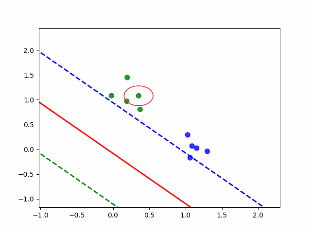

## 1. Mathematical Fundamentals 

> _"The earliest predecessors of modern `deep learning` were simple linear models motivated from a neuroscientific perspective. These models were designed to take a set of `n` input values, and associate them with an output `y`. These models would learn a set of weights and compute their output" — (Goodfellow, Bengio, & Courville, 2016, p. 14)_

### 1.1 Decomposition

1. **Inputs:** Each **simple perceptron** receives inputs `x` as a vector of values: 

$$
\mathbf{x} = (x_1, x_2, \dots, x_n)
$$

2.  **Weights:** For each input, the perceptron has assigned a weight `w`, that represents _"the importance"_ for the decision. The weights represent a different vector:
   
$$
\mathbf{w} = (w_1, w_2, \dots, w_n)
$$

4. **Linear Combination:** The first mathematical operation of a perceptron is a linear combination of inputs and weights:

$$
z = \mathbf{w} \cdot \mathbf{x} + b = \sum_{i=1}^n w_i x_i + b
$$

4. **Bias:** Where bias `b` represents the _"additional displacement"_ that gives more flexibility to the data separation

5. **Activation Function:** The value `z` is passed through a step function, which produces a binary output:

$$
\hat{y} =
\begin{cases}
1 & \text{if } z \geq 0 \\
0 & \text{if } z < 0
\end{cases}
$$

6. **Learning Rule:** The perceptron learns by adjusting its weights with each training example `(x, y)`.

    **Where:**

    - `η` = learning rate `(0 < η ≤ 1)`
    - `y` = true label
    - `ŷ` = perceptron output

$$
w_i \leftarrow w_i + \eta (y - \hat{y}) x_i
$$

$$
b \leftarrow b + \eta (y - \hat{y})
$$



### 1.2 Example

1. **We want to learn:**

    These are the training data. They define the logic function we want the perceptron to learn (in this case, a simplified `AND`). 

    - `(0,0) → 0`
    - `(1,1) → 1`

2. **Initialization:**

    We start with weights for each input, and the bias set to zero. The value `η` is the learning rate, wich controls how much the parameters are adjusted when there is an error.

    - `w1 = 0, w2 = 0`
    - `b = 0`
    - `η = 1`

3. **Epoch 1:**

    - input `(0,0)`, `y = 0`

        `z = 0·0 + 0·0 + 0 = 0 → ŷ = 1 (error)`

        The predicted output is `1`, but it should be `0`. `Error`.

        **Update:**

        `w1 = 0 + 1·(0–1)·0 = 0`

        `w2 = 0 + 1·(0–1)·0 = 0`

        `b = 0 + 1·(0–1) = –1`

        The weights don’t change because the input is `(0,0)`. Only the bias changes, from `0` to `–1`.

    - input `(1,1)`, `y = 1`

        `z = 0·1 + 0·1 – 1 = –1 → ŷ = 0 (error)`

        The predicted output is `0`, but it should be `1`. Another `error`.

        **Update:**

        `w1 = 0 + 1·(1–0)·1 = 1`

        `w2 = 0 + 1·(1–0)·1 = 1`

        `b = –1 + 1·(1–0) = 0`

        Now the weights increase because the input was `(1,1)`, and the correct label is `1`. The bias goes back to `0`.

4. **Epoch 2:**

    - input `(0,0)`, `y = 0`

        `z = 0 + 0 + 0 = 0 → ŷ = 1 (error)`

        Once again, it predicts `1` when it should be `0`.

        **Update:**

        `w1 = 1`
        
        `w2 = 1`	
        
        `b = -1`

        The weights stay the same, but the bias decreases from `0` to `–1`.

    - input `(1,1)`, `y = 1`

        `z = 1 + 1 – 1 = 1 → ŷ = 1 (correct)`

        This time the perceptron gets it right, so no update is needed.

5. **Inference:**

   After training (with all the epochs), we ended with: `w1 = 1`, `w2 = 1` and `b = -1`

    - input `(0,0)`
    
        `z = 1·0 + 1·0 – 1 = –1 → ŷ = 0`

        Correct classification `(0,0 → 0)`.

    - input `(1,1)`

        `z = 1·1 + 1·1 – 1 = 1 → ŷ = 1`

        Correct classification `(1,1 → 1)`.

## 2. Simple Perceptron Module

The `SimplePerceptron` module implements a complete cycle of the training and inference for this model, implemented from zero, without external libraries _(e.g., NumPy, Sk-learn, PyTorch,...)_.

### 2.1 Requirements

- Python 3.9+

### 2.2 Usage

1. Create or download `gate-or.json` with all the training date, with this format `list[dict]`, where each `dict` save a `list[int/float]` and a `int`:

```json
[
    {"features": [0, 0], "label": 0},
    {"features": [0, 1], "label": 1},
    {"features": [1, 0], "label": 1},
    {"features": [1, 1], "label": 1}
]
```

2. Execute the training model module:

```python
    # define the model metadata
    model_info = {
        'model_name': "Simple Perceptron", 
        'description': "A simple perceptron trained with the gate `OR`", 
        'author': "Dylan Sutton Chavez"
    }

    # initialize the SimplePerceptron class
    simple_perceptron = SimplePerceptron()

    # train the perceptron with specified parameters
    simple_perceptron.train(epochs=30, patience=3, labeled_dataset_path='gate-or.json', learning_rate=0.65, model_info=model_info)
```

3. Output (a list of `logs` _(epoch, weights, bias, error, and time)_, `early stopping`, and model root):

```txt
Epoch 1/30
    Weights: [0.5666446924598851, 0.49325541245988513] | Bias: 0.68097592 | Error: 0.75 | Time: 0.0166
Epoch 2/30
    Weights: [0.5666446924598851, 0.49325541245988513] | Bias: 0.68097592 | Error: 0.0 | Time: 0.0234
Epoch 3/30
    Weights: [0.5666446924598851, 0.49325541245988513] | Bias: 0.68097592 | Error: 0.0 | Time: 0.0219
Epoch 4/30
    Weights: [0.5666446924598851, 0.49325541245988513] | Bias: 0.68097592 | Error: 0.0 | Time: 0.0348
Early Stopping
Model saved as `simple-perceptron.2025_10_13.json`
```

4. You can make inference with the trained model:

```python
    # load a saved model and make a prediction
    prediction = simple_perceptron.inference(model_path='simple-perceptron.2025_10_13.json', features=[0, 1])
    print(prediction)
```

5. Output (this means the input `[0, 1]` was classified as an `"OR = 1"`):

```txt
1
```

## 3. Using the Model in Complex Tasks

After understanding how the **simple perceptron** works, may seem too basic for complex tasks. However, now with **giant models with billions of parameters**, these classic algorithms are **efficient solutions**. The foundation for this lies in a principle described by Cover _"Thus the probability of separability shows a pronounced threshold effect when the number of patterns is equal to twice the number of dimensions..." — (Cover, 1958, p. 331)_. This suggests that many complex problems can become **linearly separable**, and thus solvable by simple models, provided the data is represented in a sufficiently **high-dimensional vector space**.

This theory is not just academic; **On October 5th, 2025**, I have an **independent research project** for threat detection, focusing on **OWASP standards**. The primary obstacle was the **lack of large, labeled datasets** for training. To overcome this, I developed a methodology: first, generating thousands of **realistic, synthetic security logs** using reproducible randomness, and then leveraging a **Large Language Model (LLM)** to label each log as either an **"attack" or "normal"**. This approach of **"black-box distillation"** proved highly effective, allowing the creation of a **200,000-entry dataset** for approximately **$30 USD**, achieving over **95% consistency** compared to manual labeling.

```json
{
    "metadata": {
        "timestamp": "string",
        "source": {
            "ip": "string",
            "port": 0
    }
    },
    "http": {
        "method": "string",
        "user_agent": "string",
        "query_params": "string",
        "endpoint": "string"
    },
    "metrics": {
        "payload_size": 0.0,
        "response_size": 0.0,
        "response_time_ms": 0
    }
}
```

The results of training a **simple perceptron** on this **high-dimensional** data are highly promising. Initial tests have achieved up to **93% efficiency** in **OWASP Top 10 attacks detection**, with an estimated **inference cost savings of over 99%** compared to commercial enterprise solutions like **AWS WAF**. I drafted it into a research paper, involves refining the vectorization methods and implementing advanced parameters, such as a **context-aware weight function** mathematically interpreted as `w(c) * x + b`, to further enhance detection capabilities.